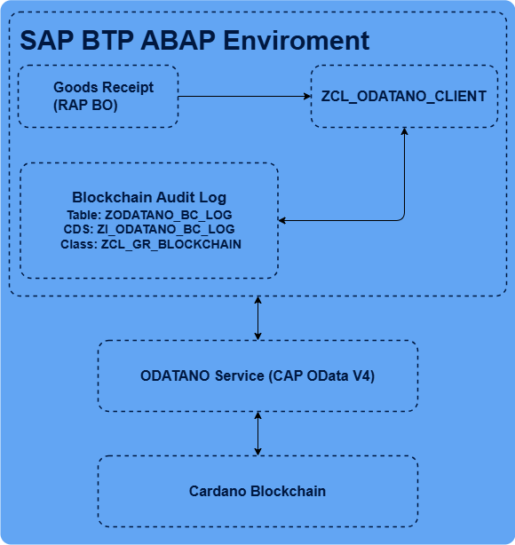
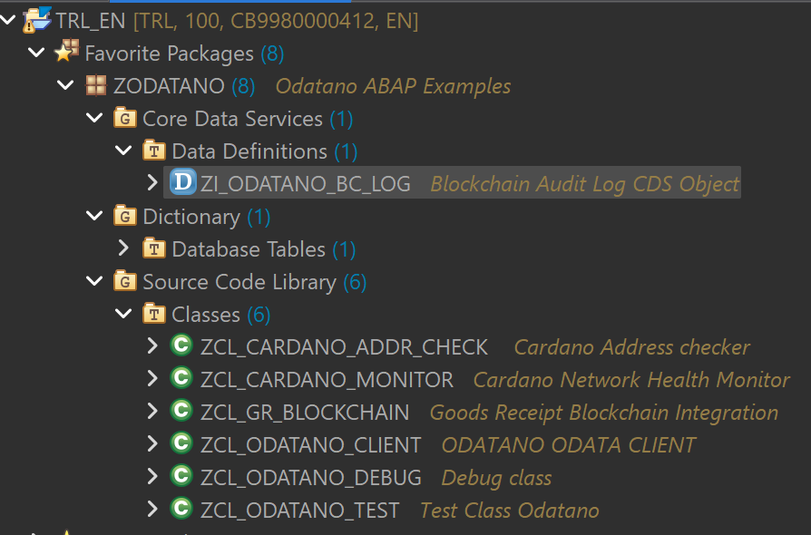
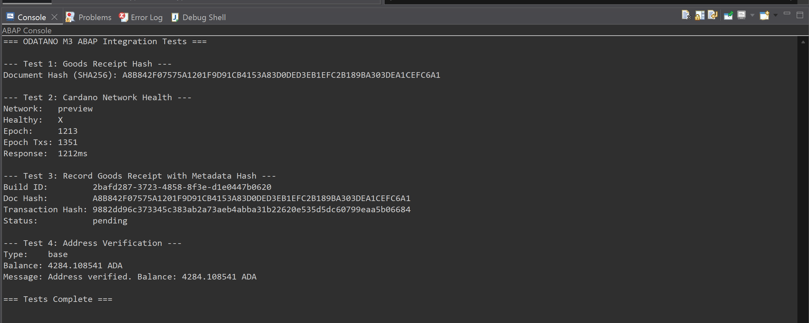

# ODATANO Milestone 3 – ABAP Integration Examples

ABAP Cloud examples demonstrating real SAP business process integration with the Cardano blockchain through the [ODATANO](https://github.com/ODATANO/ODATANO) OData V4 API. All examples target **SAP BTP ABAP Environment** and follow the ABAP RESTful Application Programming Model (RAP).

## Architecture


## Objects Overview

### Database Table

| Object | Description |
|--------|-------------|
| `ZODATANO_BC_LOG` | Blockchain audit log – stores document hashes, transaction references, and status |

### CDS View

| Object | Description |
|--------|-------------|
| `ZI_ODATANO_BC_LOG` | Root view entity on the audit log table for RAP/OData exposure |

### ABAP Classes

| Class | Description |
|-------|-------------|
| `ZCL_ODATANO_CLIENT` | Generic HTTP client wrapper for the ODATANO OData V4 API (read & transaction endpoints) |
| `ZCL_GR_BLOCKCHAIN` | Supply Chain scenario – records goods receipts on Cardano with SHA-256 hash as metadata |
| `ZCL_CARDANO_MONITOR` | Operations scenario – monitors Cardano network health status with response time tracking |
| `ZCL_CARDANO_ADDR_CHECK` | Procurement scenario – verifies Cardano wallet addresses and balances before payment release |
| `ZCL_ODATANO_TEST` | Console application (`if_oo_adt_classrun`) to test all integration scenarios |

## Integration Scenarios

### 1. Supply Chain – Goods Receipt Blockchain Anchoring

When goods are received at a plant, the system computes a SHA-256 hash of the receipt data and writes it to the Cardano blockchain as transaction metadata via ODATANO. This creates a tamper-proof audit trail that auditors or trading partners can independently verify.

**Flow:**
```
SAP Goods Receipt → SHA-256 Hash → ODATANO BuildTxWithMetadata → External Signing → Submit → Audit Log
```

**ODATANO API:** `POST /odata/v4/cardano-transaction/BuildTransactionWithMetadata`

### 2. Network Health Monitoring

An operations dashboard class queries the Cardano network status through ODATANO and tracks response times. Useful for monitoring blockchain availability before executing supply chain transactions.

**ODATANO API:** `GET /odata/v4/cardano-odata/GetNetworkInformation`

### 3. Address Verification for Procurement

Before releasing a payment, the system verifies that the recipient's Cardano wallet address exists on-chain and optionally checks for a minimum balance. Can be integrated into payment approval workflows.

**ODATANO API:** `GET /odata/v4/cardano-odata/GetAddressByBech32`

## Prerequisites

- SAP BTP ABAP Environment (Trial or Licensed)
- Eclipse with ADT (ABAP Development Tools)
- ODATANO service deployed and reachable from BTP (e.g. on Cloud Foundry)

## Setup

1. Create an ABAP package (e.g. `Z_ODATANO`)
2. Create all objects in order:
   - `ZODATANO_BC_LOG` (Database Table)
   - `ZI_ODATANO_BC_LOG` (CDS View)
   - `ZCL_ODATANO_CLIENT` (HTTP Client)
   - `ZCL_GR_BLOCKCHAIN` (Goods Receipt Logic)
   - `ZCL_CARDANO_MONITOR` (Network Monitor)
   - `ZCL_CARDANO_ADDR_CHECK` (Address Verification)
   - `ZCL_ODATANO_TEST` (Test Console App)
3. Update the ODATANO service URL in `ZCL_ODATANO_TEST`
4. Run with **Right-click → Run As → ABAP Application (Console)**

### Example Package Structure after creation:


## Running the Tests

The test console app (`ZCL_ODATANO_TEST`) includes four tests:

| Test | Requires ODATANO | Description |
|------|-------------------|-------------|
| 1 – Document Hashing | No | Computes SHA-256 hash of a sample goods receipt |
| 2 – Network Health | Yes | Queries Cardano network status via ODATANO |
| 3 – Goods Receipt Recording | Yes | Full flow: hash → build metadata TX → audit log |
| 4 – Address Verification | Yes | Verifies a Cardano testnet address |

Tests 2–4 gracefully handle connection errors when ODATANO is not reachable.

## Example Output

