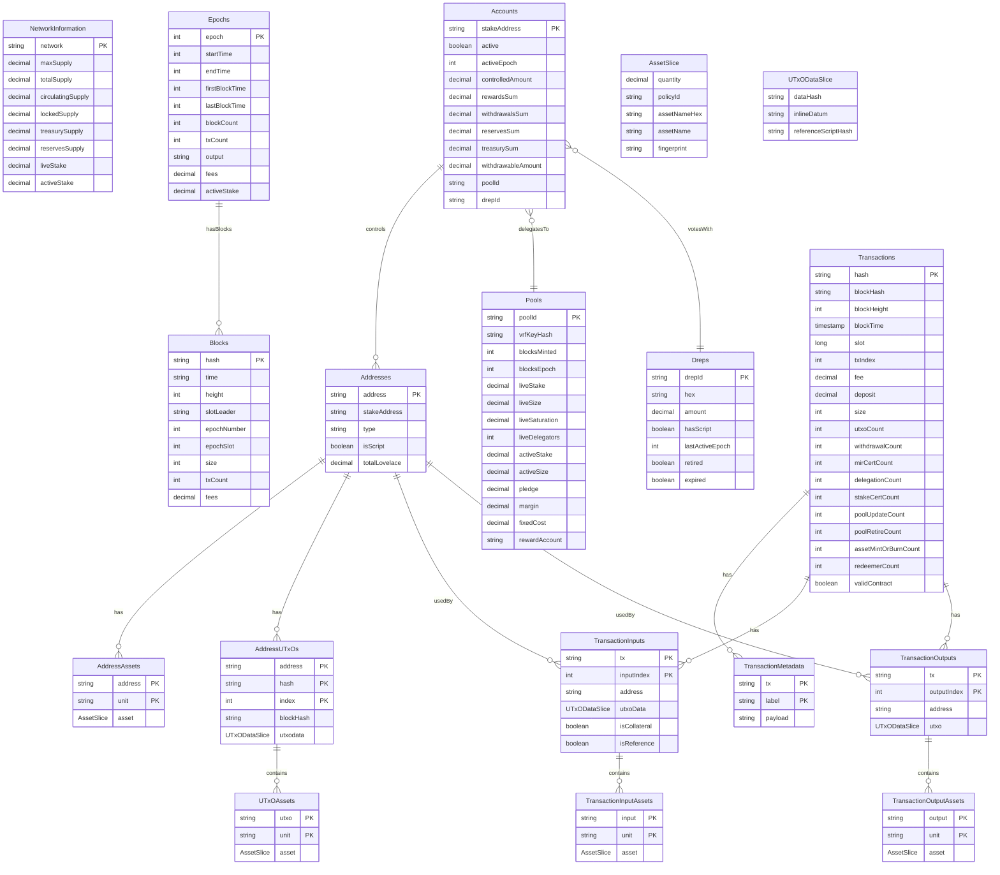

```mermaid
erDiagram

    %% -----------------------------------------------------
    %% Core Types as comments (not real ER entities)
    %% Blake2b224  : String(56)
    %% Blake2b256  : String(64)
    %% Lovelace    : Decimal(20,0)
    %% AssetUnit   : String(120)
    %% bech32      : String(120)
    %% MetadataLabel : String(5)
    %% -----------------------------------------------------

    NetworkInformation {
        string network PK
        decimal maxSupply
        decimal totalSupply
        decimal circulatingSupply
        decimal lockedSupply
        decimal treasurySupply
        decimal reservesSupply
        decimal liveStake
        decimal activeStake
    }

    Epochs {
        int    epoch PK
        int    startTime
        int    endTime
        int    firstBlockTime
        int    lastBlockTime
        int    blockCount
        int    txCount
        string output
        decimal fees
        decimal activeStake
    }

    Blocks {
        string hash PK
        string time
        int    height
        string slotLeader
        int    epochNumber
        int    epochSlot
        int    size
        int    txCount
        decimal fees
    }

    Pools {
        string  poolId PK
        string  vrfKeyHash
        int     blocksMinted
        int     blocksEpoch
        decimal liveStake
        decimal liveSize
        decimal liveSaturation
        int     liveDelegators
        decimal activeStake
        decimal activeSize
        decimal pledge
        decimal margin
        decimal fixedCost
        string  rewardAccount
    }

    Dreps {
        string  drepId PK
        string  hex
        decimal amount
        boolean hasScript
        int     lastActiveEpoch
        boolean retired
        boolean expired
    }

    Addresses {
        string  address PK
        string  stakeAddress
        string  type
        boolean isScript
        decimal totalLovelace
    }

    Accounts {
        string  stakeAddress PK
        boolean active
        int     activeEpoch
        decimal controlledAmount
        decimal rewardsSum
        decimal withdrawalsSum
        decimal reservesSum
        decimal treasurySum
        decimal withdrawableAmount
        string  poolId
        string  drepId
    }

    AddressAssets {
        string  address PK
        string  unit PK
        AssetSlice asset
    }

    AssetSlice {
        decimal quantity
        string  policyId
        string  assetNameHex
        string  assetName
        string  fingerprint
    }

    AddressUTxOs {
        string address PK
        string hash PK
        int    index PK
        string blockHash
        UTxODataSlice utxodata
    }

    UTxODataSlice {
        string dataHash
        string inlineDatum
        string referenceScriptHash
    }

    UTxOAssets {
        string utxo PK
        string unit PK
        AssetSlice asset
    }

    Transactions {
        string   hash PK
        string   blockHash
        int      blockHeight
        timestamp blockTime
        long     slot
        int      txIndex
        decimal  fee
        decimal  deposit
        int      size
        int      utxoCount
        int      withdrawalCount
        int      mirCertCount
        int      delegationCount
        int      stakeCertCount
        int      poolUpdateCount
        int      poolRetireCount
        int      assetMintOrBurnCount
        int      redeemerCount
        boolean  validContract
    }

    TransactionMetadata {
        string tx PK
        string label PK
        string payload
    }

    TransactionInputs {
        string tx PK
        int    inputIndex PK
        string address
        UTxODataSlice utxoData
        boolean isCollateral
        boolean isReference
    }

    TransactionOutputs {
        string tx PK
        int    outputIndex PK
        string address
        UTxODataSlice utxo
    }

    TransactionInputAssets {
        string input PK
        string unit  PK
        AssetSlice asset
    }

    TransactionOutputAssets {
        string output PK
        string unit   PK
        AssetSlice asset
    }

    %% -----------------------------------------------------
    %% RELATIONSHIPS
    %% -----------------------------------------------------

    %% Epoch <-> Blocks
    Epochs ||--o{ Blocks : hasBlocks
    %% (via Blocks.epochNumber -> Epochs.epoch)

    %% Address relations
    Addresses   ||--o{ AddressAssets : has
    Addresses   ||--o{ AddressUTxOs  : has
    AddressUTxOs ||--o{ UTxOAssets   : contains

    %% Accounts relations
    Accounts ||--o{ Addresses : controls
    Accounts }o--|| Pools     : delegatesTo
    Accounts }o--|| Dreps     : votesWith

    %% Transactions and related data
    Transactions ||--o{ TransactionMetadata     : has
    Transactions ||--o{ TransactionInputs       : has
    Transactions ||--o{ TransactionOutputs      : has

    TransactionInputs  ||--o{ TransactionInputAssets   : contains
    TransactionOutputs ||--o{ TransactionOutputAssets  : contains

    %% Inputs/Outputs reference Addresses
    Addresses ||--o{ TransactionInputs  : usedBy
    Addresses ||--o{ TransactionOutputs : usedBy
```
