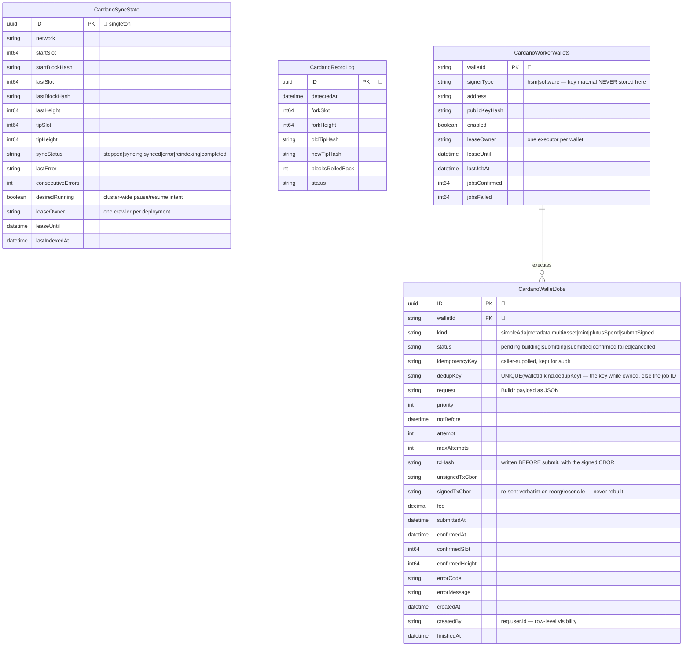

# ODATANO Blockchain Schema

```mermaid
---
config:
  theme: base
  themeVariables:
    primaryColor: "#0C5ECF"
    primaryTextColor: "#001840"
    primaryBorderColor: "#001840"
    lineColor: "#001840"
    secondaryColor: "#4d7bc5"
    tertiaryColor: "#0C5ECF"
    mainBkg: "#0C5ECF"
    nodeBorder: "#001840"
    clusterBkg: "#001840"
    clusterBorder: "#001840"
    titleColor: "#001840"
    edgeLabelBackground: "#0C5ECF"
    textColor: "#001840"
    background: "#4d7bc5"
    fontSize: "13px"
    fontFamily: "monospace"
    attributeBackgroundColorEven: "#4d7bc5"
    attributeBackgroundColorOdd: "#4d7bc5"
  er:
    layoutDirection: "TB"
    fontSize: 12
    useMaxWidth: false
    fill: "#0C5ECF"
    stroke: "#0C5ECF"
---

erDiagram
    NetworkInformation {
        string network PK "🔑"
        decimal maxSupply
        decimal totalSupply
        decimal circulatingSupply
        decimal lockedSupply
        decimal treasurySupply
        decimal reservesSupply
        decimal liveStake
        decimal activeStake
    }

    Epochs {
        int epoch PK "🔑"
        int startTime
        int endTime
        int firstBlockTime
        int lastBlockTime
        int blockCount
        int txCount
        string output
        decimal fees
        decimal activeStake
    }

    Blocks {
        string hash PK "🔑"
        string time
        int height
        string slotLeader
        int epochNumber FK "🔗"
        int epochSlot
        int size
        int txCount
        decimal fees
    }

    Pools {
        string poolId PK "🔑"
        string vrfKeyHash
        int blocksMinted
        int blocksEpoch
        decimal liveStake
        decimal liveSize
        decimal liveSaturation
        int liveDelegators
        decimal activeStake
        decimal activeSize
        decimal pledge
        decimal margin
        decimal fixedCost
        string rewardAccount
    }

    Dreps {
        string drepId PK "🔑"
        string hex
        decimal amount
        boolean hasScript
        int lastActiveEpoch
        boolean retired
        boolean expired
    }

    Addresses {
        string address PK "🔑"
        string stakeAddress
        string type
        boolean isScript
        decimal totalLovelace
        boolean hasAssets
        boolean hasUTxOs
    }

    Accounts {
        string stakeAddress PK "🔑"
        boolean active
        int activeEpoch
        decimal controlledAmount
        decimal rewardsSum
        decimal withdrawalsSum
        decimal reservesSum
        decimal treasurySum
        decimal withdrawableAmount
        string poolId FK "🔗"
        string drepId FK "🔗"
        boolean hasAddresses
    }

    AddressAssets {
        string address FK "🔗"
        string unit
        decimal quantity
        string policyId
        string assetNameHex
        string assetName
        string fingerprint
    }

    AddressUTxOs {
        string address FK "🔗"
        string hash
        int index
        string blockHash
        string dataHash
        string inlineDatum
        string referenceScriptHash
        boolean hasAssets
    }

    UTxOAssets {
        string utxo FK "🔗"
        string unit
        decimal quantity
        string policyId
        string assetNameHex
        string assetName
        string fingerprint
    }

    Transactions {
        string hash PK "🔑"
        string blockHash
        int blockHeight
        long blockTime
        long slot
        int txIndex
        decimal fee
        decimal deposit
        int size
        boolean hasMetadata
        boolean hasInputs
        boolean hasOutputs
    }

    TransactionMetadata {
        int id PK "🔑"
        string tx FK "🔗"
        string label
        string payload
    }

    TransactionInputs {
        string tx FK "🔗"
        int inputIndex
        string address FK "🔗"
        string dataHash
        string inlineDatum
        string referenceScriptHash
        boolean isCollateral
        boolean isReference
        boolean hasAddresses
        boolean hasAssets
    }

    TransactionOutputs {
        string tx FK "🔗"
        int outputIndex
        string address FK "🔗"
        string dataHash
        string inlineDatum
        string referenceScriptHash
        boolean hasAddresses
        boolean hasAssets
    }

    TransactionInputAssets {
        string input FK "🔗"
        string unit
        decimal quantity
        string policyId
        string assetNameHex
        string assetName
        string fingerprint
    }

    TransactionOutputAssets {
        string output FK "🔗"
        string unit
        decimal quantity
        string policyId
        string assetNameHex
        string assetName
        string fingerprint
    }

    TransactionBuilds {
        uuid buildId PK "🔑"
        string network
        string senderAddress
        string unsignedTxCbor
        string txHash
        decimal fee
        string builder
        string scriptHash
        string fingerprint
        string scriptAddress
        boolean hasInputs
        boolean hasOutputs
        datetime validFrom
        datetime validTo
    }

    TransactionBuildInputs {
        uuid build FK "🔗"
        int inputIndex
        string address
        decimal lovelaceAmount
        string utxoHash
        int utxoIndex
        boolean hasAssets
    }

    TransactionBuildInputAssets {
        uuid buildInput FK "🔗"
        string unit
        decimal quantity
        string policyId
        string assetNameHex
        string assetName
    }

    TransactionBuildOutputs {
        uuid build FK "🔗"
        int outputIndex
        string address
        decimal lovelaceAmount
        boolean hasAssets
    }

    TransactionBuildOutputAssets {
        uuid buildOutput FK "🔗"
        string unit
        decimal quantity
        string policyId
        string assetNameHex
        string assetName
    }

    TransactionSubmissions {
        uuid submissionId PK "🔑"
        string network
        string signedTxCbor
        string txHash
        string status
        string backend
        datetime submittedAt
        boolean hasErrors
        datetime validFrom
        datetime validTo
    }

    TransactionSubmissionErrors {
        uuid submission FK "🔗"
        int errorIndex
        string errorCode
        string errorMessage
        string backend
    }

    SigningRequests {
        uuid id PK "🔑"
        uuid build FK "🔗"
        string txBodyHash
        string unsignedTxCbor
        string cip30TxCbor
        string network
        string status
        string message
        string cardanoCliCommand
        string signerType
        string signerInfo
        string hsmKeyId
        datetime createdAt
        datetime expiresAt
        datetime signedAt
        datetime verifiedAt
        datetime submittedAt
    }

    SignatureVerifications {
        uuid id PK "🔑"
        uuid signingRequest FK "🔗"
        string signedTxCbor
        boolean isValid
        int witnessCount
        string signerKeyHashes
        string signerType
        string signerInfo
        string errorMessage
        datetime verifiedAt
    }

    AddressSigningRequests {
        string address FK "🔗"
        uuid signingRequest FK "🔗"
    }

    AddressTransactionBuilds {
        string address FK "🔗"
        uuid txBuild FK "🔗"
    }

    AddressTransactions {
        string address FK "🔗"
        string tx FK "🔗"
        long netAmount
        long blockTime
        string netAssets
        boolean hasAssets
    }

    Epochs ||--o{ Blocks : "has"
    Addresses ||--o{ AddressAssets : "contains"
    Addresses ||--o{ AddressUTxOs : "contains"
    AddressUTxOs ||--o{ UTxOAssets : "contains"
    Accounts ||--o{ Addresses : "controls"
    Accounts }o--|| Pools : "delegatesTo"
    Accounts }o--|| Dreps : "votesWith"
    Transactions ||--o{ TransactionMetadata : "has"
    Transactions ||--o{ TransactionInputs : "has"
    Transactions ||--o{ TransactionOutputs : "has"
    TransactionInputs ||--o{ TransactionInputAssets : "contains"
    TransactionOutputs ||--o{ TransactionOutputAssets : "contains"
    Addresses ||--o{ TransactionInputs : "references"
    Addresses ||--o{ TransactionOutputs : "references"
    TransactionBuilds ||--o{ TransactionBuildInputs : "has"
    TransactionBuilds ||--o{ TransactionBuildOutputs : "has"
    TransactionBuildInputs ||--o{ TransactionBuildInputAssets : "contains"
    TransactionBuildOutputs ||--o{ TransactionBuildOutputAssets : "contains"
    TransactionSubmissions ||--o{ TransactionSubmissionErrors : "has"
    SigningRequests }o--|| TransactionBuilds : "references"
    SigningRequests ||--o{ SignatureVerifications : "has"
    Addresses ||--o{ AddressSigningRequests : "has"
    AddressSigningRequests }o--|| SigningRequests : "references"
    Addresses ||--o{ AddressTransactionBuilds : "has"
    AddressTransactionBuilds }o--|| TransactionBuilds : "references"
    Addresses ||--o{ AddressTransactions : "has"
    AddressTransactions }o--|| Transactions : "references"
```

## v2.0 entities — chain crawler and wallet worker

Four entities were added in 2.0. They are standalone: the crawler writes into the existing
`Blocks`/`Transactions` graph above but keeps its own cursor, and the worker's tables reference
wallets and jobs only, never the chain entities.

Two constraints in this model carry the payment-safety guarantees and are easy to miss:

- **`dedupKey` with `UNIQUE(walletId, kind, dedupKey)`** is what makes idempotency atomic. It holds
  the caller's `idempotencyKey` while the job owns it, and the job's own ID otherwise — so keyless
  jobs never contend and terminal jobs release the key without relying on NULL semantics.
- **`status = submitting`** is the durable pre-submit state: `txHash` and `signedTxCbor` are written
  before the transaction can reach a backend, and the row stays non-terminal so it keeps holding the
  idempotency key. A crash there is reconciled against the chain, not failed.
