```mermaid
erDiagram
    NetworkInformation {
        string network PK
        decimal maxSupply
        decimal totalSupply
        decimal circulatingSupply
        decimal lockedSupply
        decimal treasurySupply
        decimal reservesSupply
        decimal liveStake
        decimal activeStake
    }

    Epochs {
        int epoch PK
        int startTime
        int endTime
        int firstBlockTime
        int lastBlockTime
        int blockCount
        int txCount
        string output
        decimal fees
        decimal activeStake
    }

    Blocks {
        string hash PK
        string time
        int height
        string slotLeader
        int epochNumber FK
        int epochSlot
        int size
        int txCount
        decimal fees
    }

    Pools {
        string poolId PK
        string vrfKeyHash
        int blocksMinted
        int blocksEpoch
        decimal liveStake
        decimal liveSize
        decimal liveSaturation
        int liveDelegators
        decimal activeStake
        decimal activeSize
        decimal pledge
        decimal margin
        decimal fixedCost
        string rewardAccount
    }

    Dreps {
        string drepId PK
        string hex
        decimal amount
        boolean hasScript
        int lastActiveEpoch
        boolean retired
        boolean expired
    }

    Addresses {
        string address PK
        string stakeAddress
        string type
        boolean isScript
        decimal totalLovelace
        boolean hasAssets
        boolean hasUTxOs
    }

    Accounts {
        string stakeAddress PK
        boolean active
        int activeEpoch
        decimal controlledAmount
        decimal rewardsSum
        decimal withdrawalsSum
        decimal reservesSum
        decimal treasurySum
        decimal withdrawableAmount
        string poolId FK
        string drepId FK
        boolean hasAddresses
    }

    AddressAssets {
        string address FK
        string unit
        decimal quantity
        string policyId
        string assetNameHex
        string assetName
        string fingerprint
    }

    AddressUTxOs {
        string address FK
        string hash
        int index
        string blockHash
        string dataHash
        string inlineDatum
        string referenceScriptHash
        boolean hasAssets
    }

    UTxOAssets {
        string utxo FK
        string unit
        decimal quantity
        string policyId
        string assetNameHex
        string assetName
        string fingerprint
    }

    Transactions {
        string hash PK
        string blockHash
        int blockHeight
        long blockTime
        long slot
        int txIndex
        decimal fee
        decimal deposit
        int size
        boolean hasMetadata
        boolean hasInputs
        boolean hasOutputs
    }

    TransactionMetadata {
        int id PK
        string tx FK
        string label
        string payload
    }

    TransactionInputs {
        string tx FK
        int inputIndex
        string address FK
        string dataHash
        string inlineDatum
        string referenceScriptHash
        boolean isCollateral
        boolean isReference
        boolean hasAddresses
        boolean hasAssets
    }

    TransactionOutputs {
        string tx FK
        int outputIndex
        string address FK
        string dataHash
        string inlineDatum
        string referenceScriptHash
        boolean hasAddresses
        boolean hasAssets
    }

    TransactionInputAssets {
        string input FK
        string unit
        decimal quantity
        string policyId
        string assetNameHex
        string assetName
        string fingerprint
    }

    TransactionOutputAssets {
        string output FK
        string unit
        decimal quantity
        string policyId
        string assetNameHex
        string assetName
        string fingerprint
    }

    TransactionBuilds {
        uuid buildId PK
        string network
        string senderAddress
        string unsignedTxCbor
        string txHash
        decimal fee
        string builder
        boolean hasInputs
        boolean hasOutputs
        datetime validFrom
        datetime validTo
    }

    TransactionBuildInputs {
        uuid build FK
        int inputIndex
        string address
        decimal lovelaceAmount
        string utxoHash
        int utxoIndex
        boolean hasAssets
    }

    TransactionBuildInputAssets {
        uuid buildInput FK
        string unit
        decimal quantity
        string policyId
        string assetNameHex
        string assetName
    }

    TransactionBuildOutputs {
        uuid build FK
        int outputIndex
        string address
        decimal lovelaceAmount
        boolean hasAssets
    }

    TransactionBuildOutputAssets {
        uuid buildOutput FK
        string unit
        decimal quantity
        string policyId
        string assetNameHex
        string assetName
    }

    TransactionSubmissions {
        uuid submissionId PK
        string network
        string signedTxCbor
        string txHash
        string status
        string backend
        datetime submittedAt
        boolean hasErrors
        datetime validFrom
        datetime validTo
    }

    TransactionSubmissionErrors {
        uuid submission FK
        int errorIndex
        string errorCode
        string errorMessage
        string backend
    }

    SigningRequests {
        uuid id PK
        uuid build FK
        string txBodyHash
        string unsignedTxCbor
        string network
        string status
        string message
        string cardanoCliCommand
        datetime createdAt
        datetime expiresAt
        datetime signedAt
        datetime verifiedAt
        datetime submittedAt
    }

    SignatureVerifications {
        uuid id PK
        uuid signingRequest FK
        string signedTxCbor
        boolean isValid
        int witnessCount
        string signerKeyHashes
        string signerType
        string signerInfo
        string errorMessage
        datetime verifiedAt
    }

    AddressSigningRequests {
        string address FK
        uuid signingRequest FK
    }

    AddressTransactionBuilds {
        string address FK
        uuid txBuild FK
    }

    AddressTransactions {
        string address FK
        string tx FK
        decimal netAmount
        boolean isInput
        boolean isOutput
    }

    Epochs ||--o{ Blocks : has
    Addresses ||--o{ AddressAssets : contains
    Addresses ||--o{ AddressUTxOs : contains
    AddressUTxOs ||--o{ UTxOAssets : contains
    Accounts ||--o{ Addresses : controls
    Accounts }o--|| Pools : delegatesTo
    Accounts }o--|| Dreps : votesWith
    Transactions ||--o{ TransactionMetadata : has
    Transactions ||--o{ TransactionInputs : has
    Transactions ||--o{ TransactionOutputs : has
    TransactionInputs ||--o{ TransactionInputAssets : contains
    TransactionOutputs ||--o{ TransactionOutputAssets : contains
    Addresses ||--o{ TransactionInputs : references
    Addresses ||--o{ TransactionOutputs : references
    TransactionBuilds ||--o{ TransactionBuildInputs : has
    TransactionBuilds ||--o{ TransactionBuildOutputs : has
    TransactionBuildInputs ||--o{ TransactionBuildInputAssets : contains
    TransactionBuildOutputs ||--o{ TransactionBuildOutputAssets : contains
    TransactionSubmissions ||--o{ TransactionSubmissionErrors : has
    SigningRequests }o--|| TransactionBuilds : references
    SigningRequests ||--o{ SignatureVerifications : has
    Addresses ||--o{ AddressSigningRequests : has
    AddressSigningRequests }o--|| SigningRequests : references
    Addresses ||--o{ AddressTransactionBuilds : has
    AddressTransactionBuilds }o--|| TransactionBuilds : references
    Addresses ||--o{ AddressTransactions : has
    AddressTransactions }o--|| Transactions : references
```

---

## M2 Milestone Additions

### Transaction Building Entities (Temporal)

**TransactionBuilds** stores unsigned transactions built via OData actions:
- **Purpose**: Track transaction building requests and provide unsigned CBOR for external signing
- **Temporal**: Yes - respects INDEX_TTL_MS
- **Key**: UUID (buildId)
- **Builder**: 'csl' (Cardano Serialization Lib) or 'buildooor'
- **Relations**: Has inputs, outputs, and their associated assets

**TransactionBuildInputs/Outputs**:
- **Purpose**: Detail the inputs and outputs of a transaction build
- **Temporal**: No - linked to parent TransactionBuilds
- **Relations**: Each can have multiple assets

**TransactionBuildInputAssets/OutputAssets**:
- **Purpose**: Native assets in transaction build inputs/outputs
- **Temporal**: No
- **Fields**: Unit, quantity, policy ID, asset name

### Transaction Submission Entities (Temporal)

**TransactionSubmissions** records submission attempts:
- **Purpose**: Track signed transaction submissions to Cardano network
- **Temporal**: Yes - respects INDEX_TTL_MS
- **Key**: UUID (submissionId)
- **Status**: 'pending', 'submitted', 'failed'
- **Backend**: Which backend processed the submission (ogmios, blockfrost, koios)

**TransactionSubmissionErrors**:
- **Purpose**: Error details from failed submissions
- **Temporal**: No - linked to parent TransactionSubmissions
- **Fields**: Error code, message, backend that failed

---

## M3 Milestone Additions

### External Signing Entities

**SigningRequests** manages the external signing workflow:
- **Purpose**: Export unsigned transactions for external signing (CIP-30 wallets, Cardano CLI, hardware wallets)
- **Temporal**: Yes - TTL-based expiration (30 minutes default)
- **Key**: UUID (id)
- **Status**: 'pending', 'signed', 'verified', 'submitted', 'expired', 'failed'
- **Relations**: References TransactionBuilds, has SignatureVerifications

**SignatureVerifications** stores cryptographic verification results:
- **Purpose**: Audit trail for signature verification attempts
- **Temporal**: No - immutable verification records
- **Key**: UUID (id)
- **Fields**: Signed CBOR, validity, witness count, signer key hashes, signer type/info
- **Relations**: References SigningRequests

### Address Association Entities

**AddressSigningRequests** links addresses to signing requests:
- **Purpose**: Query signing requests by sender address
- **Temporal**: No
- **Key**: Composite (address + signingRequest)
- **Use Case**: "Show me all pending signing requests for this address"

**AddressTransactionBuilds** links addresses to transaction builds:
- **Purpose**: Query transaction builds by sender address
- **Temporal**: No
- **Key**: Composite (address + txBuild)
- **Use Case**: "Show me all transaction builds for this address"

**AddressTransactions** tracks address transaction history:
- **Purpose**: Query transactions affecting an address with net amounts
- **Temporal**: No
- **Key**: Composite (address + tx)
- **Fields**: Net amount change, isInput, isOutput flags
- **Use Case**: "Show me transaction history with amounts for this address"

---
