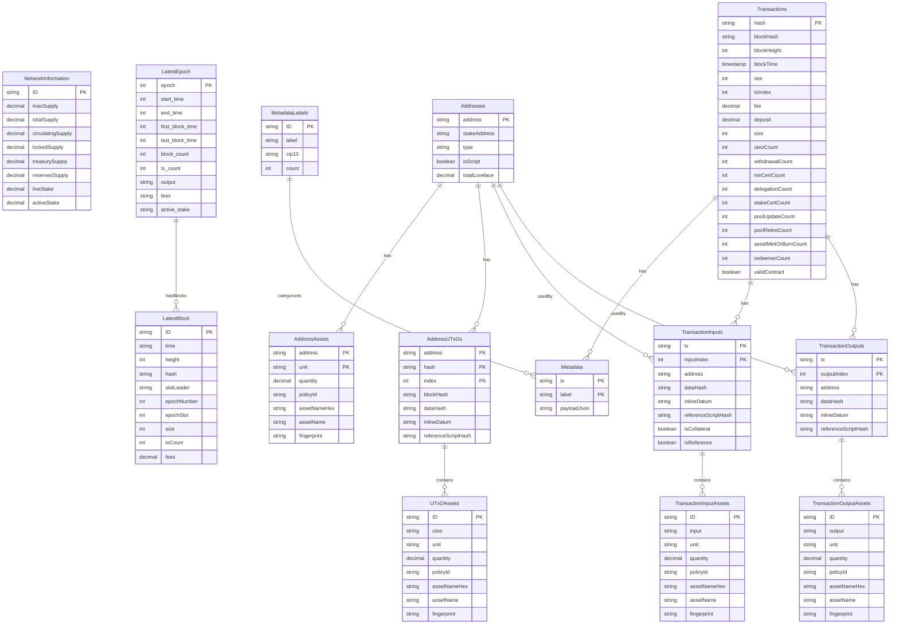

---
config:
  layout: elk
---

```mermaid
erDiagram

    %% -----------------------------------------------------
    %% Core Types as comments (not real ER entities)
    %% Blake2b224  : String(56)
    %% Blake2b256  : String(64)
    %% Lovelace    : Decimal(20,0)
    %% AssetUnit   : String(120)
    %% bech32      : String(120)
    %% MetadataLabel : String(5)
    %% -----------------------------------------------------

    NetworkInformation {
        string ID PK
        decimal maxSupply
        decimal totalSupply
        decimal circulatingSupply
        decimal lockedSupply
        decimal treasurySupply
        decimal reservesSupply
        decimal liveStake
        decimal activeStake
    }

    LatestEpoch {
        int epoch PK
        int start_time
        int end_time
        int first_block_time
        int last_block_time
        int block_count
        int tx_count
        string output
        string fees
        string active_stake
    }

    LatestBlock {
        string ID PK
        string time
        int height
        string hash
        string slotLeader
        int epochNumber
        int epochSlot
        int size
        int txCount
        decimal fees
    }

    Addresses {
        string address PK
        string stakeAddress
        string type
        boolean isScript
        decimal totalLovelace
    }

    AddressAssets {
        string address PK
        string unit PK
        decimal quantity
        string policyId
        string assetNameHex
        string assetName
        string fingerprint
    }

    AddressUTxOs {
        string address PK
        string hash PK
        int index PK
        string blockHash
        string dataHash
        string inlineDatum
        string referenceScriptHash
    }

    UTxOAssets {
        string ID PK
        string utxo
        string unit
        decimal quantity
        string policyId
        string assetNameHex
        string assetName
        string fingerprint
    }

    Transactions {
        string hash PK
        string blockHash
        int blockHeight
        timestamp blockTime
        int slot
        int txIndex
        decimal fee
        decimal deposit
        int size
        int utxoCount
        int withdrawalCount
        int mirCertCount
        int delegationCount
        int stakeCertCount
        int poolUpdateCount
        int poolRetireCount
        int assetMintOrBurnCount
        int redeemerCount
        boolean validContract
    }

    MetadataLabels {
        string ID PK
        string label
        string cip10
        int count
    }

    Metadata {
        string tx PK
        string label PK
        string payloadJson
    }

    TransactionInputs {
        string tx PK
        int inputIndex PK
        string address
        string dataHash
        string inlineDatum
        string referenceScriptHash
        boolean isCollateral
        boolean isReference
    }

    TransactionOutputs {
        string tx PK
        int outputIndex PK
        string address
        string dataHash
        string inlineDatum
        string referenceScriptHash
    }

    TransactionInputAssets {
        string ID PK
        string input
        string unit
        decimal quantity
        string policyId
        string assetNameHex
        string assetName
        string fingerprint
    }

    TransactionOutputAssets {
        string ID PK
        string output
        string unit
        decimal quantity
        string policyId
        string assetNameHex
        string assetName
        string fingerprint
    }

    %% -----------------------------------------------------
    %% RELATIONSHIPS
    %% -----------------------------------------------------

    %% Epoch <-> Latest Blocks
    LatestEpoch ||--o{ LatestBlock : hasBlocks

    %% Address relations
    Addresses ||--o{ AddressAssets : has
    Addresses ||--o{ AddressUTxOs  : has

    AddressUTxOs ||--o{ UTxOAssets : contains

    %% Transactions and related data
    Transactions ||--o{ Metadata           : has
    Transactions ||--o{ TransactionInputs  : has
    Transactions ||--o{ TransactionOutputs : has

    TransactionInputs  ||--o{ TransactionInputAssets   : contains
    TransactionOutputs ||--o{ TransactionOutputAssets  : contains

    %% Inputs/Outputs reference Addresses
    Addresses ||--o{ TransactionInputs  : usedBy
    Addresses ||--o{ TransactionOutputs : usedBy

    %% Metadata labels
    MetadataLabels ||--o{ Metadata : categorizes
```
