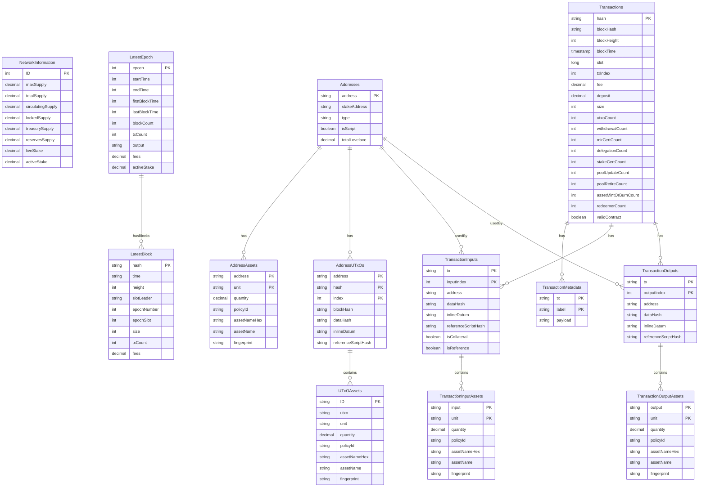

---
config:
  layout: elk
---

```mermaid
erDiagram

    %% -----------------------------------------------------
    %% Core Types as comments (not real ER entities)
    %% Blake2b224  : String(56)
    %% Blake2b256  : String(64)
    %% Lovelace    : Decimal(20,0)
    %% AssetUnit   : String(120)
    %% bech32      : String(120)
    %% MetadataLabel : String(5)
    %% -----------------------------------------------------

    NetworkInformation {
        int    ID PK
        decimal maxSupply
        decimal totalSupply
        decimal circulatingSupply
        decimal lockedSupply
        decimal treasurySupply
        decimal reservesSupply
        decimal liveStake
        decimal activeStake
    }

    LatestEpoch {
        int    epoch PK
        int    startTime
        int    endTime
        int    firstBlockTime
        int    lastBlockTime
        int    blockCount
        int    txCount
        string output
        decimal fees
        decimal activeStake
    }

    LatestBlock {
        string hash PK
        string time
        int    height
        string slotLeader
        int    epochNumber
        int    epochSlot
        int    size
        int    txCount
        decimal fees
    }

    Addresses {
        string  address PK
        string  stakeAddress
        string  type
        boolean isScript
        decimal totalLovelace
    }

    AddressAssets {
        string  address PK
        string  unit PK
        decimal quantity
        string  policyId
        string  assetNameHex
        string  assetName
        string  fingerprint
    }

    AddressUTxOs {
        string address PK
        string hash PK
        int    index PK
        string blockHash
        string dataHash
        string inlineDatum
        string referenceScriptHash
    }

    UTxOAssets {
        string ID PK
        string utxo
        string unit
        decimal quantity
        string policyId
        string assetNameHex
        string assetName
        string fingerprint
    }

    Transactions {
        string   hash PK
        string   blockHash
        int      blockHeight
        timestamp blockTime
        long     slot
        int      txIndex
        decimal  fee
        decimal  deposit
        int      size
        int      utxoCount
        int      withdrawalCount
        int      mirCertCount
        int      delegationCount
        int      stakeCertCount
        int      poolUpdateCount
        int      poolRetireCount
        int      assetMintOrBurnCount
        int      redeemerCount
        boolean  validContract
    }

    TransactionMetadata {
        string tx PK
        string label PK
        string payload
    }

    TransactionInputs {
        string tx PK
        int    inputIndex PK
        string address
        string dataHash
        string inlineDatum
        string referenceScriptHash
        boolean isCollateral
        boolean isReference
    }

    TransactionOutputs {
        string tx PK
        int    outputIndex PK
        string address
        string dataHash
        string inlineDatum
        string referenceScriptHash
    }

    TransactionInputAssets {
        string input PK
        string unit  PK
        decimal quantity
        string  policyId
        string  assetNameHex
        string  assetName
        string  fingerprint
    }

    TransactionOutputAssets {
        string output PK
        string unit   PK
        decimal quantity
        string  policyId
        string  assetNameHex
        string  assetName
        string  fingerprint
    }

    %% -----------------------------------------------------
    %% RELATIONSHIPS
    %% -----------------------------------------------------

    %% Epoch <-> Latest Blocks
    LatestEpoch ||--o{ LatestBlock : hasBlocks
    %% (via LatestBlock.epochNumber -> LatestEpoch.epoch)

    %% Address relations
    Addresses   ||--o{ AddressAssets : has
    Addresses   ||--o{ AddressUTxOs  : has
    AddressUTxOs ||--o{ UTxOAssets   : contains

    %% Transactions and related data
    Transactions ||--o{ TransactionMetadata     : has
    Transactions ||--o{ TransactionInputs       : has
    Transactions ||--o{ TransactionOutputs      : has

    TransactionInputs  ||--o{ TransactionInputAssets   : contains
    TransactionOutputs ||--o{ TransactionOutputAssets  : contains

    %% Inputs/Outputs reference Addresses
    Addresses ||--o{ TransactionInputs  : usedBy
    Addresses ||--o{ TransactionOutputs : usedBy
```
