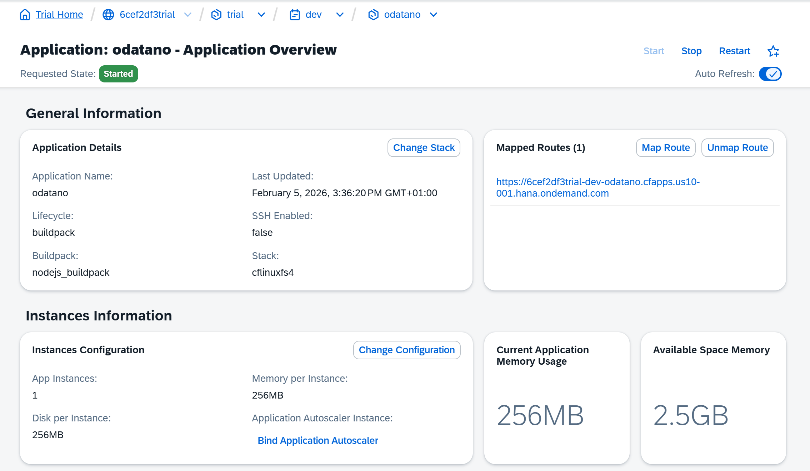
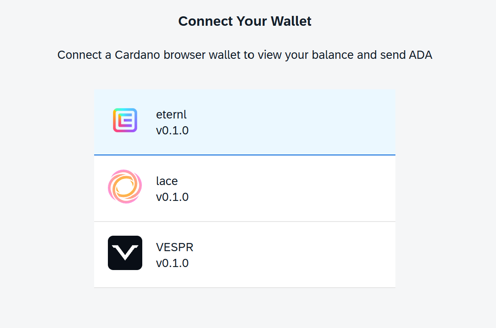

# SAP Integration Examples

This guide demonstrates how to integrate ODATANO with SAP systems, including OData consumption from S/4HANA, ABAP code templates, and enterprise use cases.

## Overview

ODATANO exposes Cardano blockchain data and transaction capabilities as standard OData V4 services. This enables seamless integration with any SAP system that supports OData consumption:

- **SAP S/4HANA** (on-premise and Cloud)
- **SAP BTP** (Business Technology Platform)
- **SAP Fiori / UI5** applications
- **ABAP-based systems** (ECC, BW, etc.)

## Architecture

```
┌────────────────────────────────────────────────────────┐
│                        SAP Landscape                   │
├────────────────────────────────────────────────────────┤
│  ┌──────────────┐  ┌──────────────┐  ┌──────────────┐  │
│  │  S/4HANA     │  │  SAP BTP     │  │  Fiori App   │  │
│  │  ABAP Report │  │  Integration │  │  (UI5)       │  │
│  └──────┬───────┘  └──────┬───────┘  └──────┬───────┘  │
│         │                 │                 │          │
│         └─────────────────┴─────────────────┘          │
│                           │                            │
│                    OData V4 Requests                   │
└───────────────────────────┼────────────────────────────┘
                            │
                            ▼
┌────────────────────────────────────────────────────────┐
│                      ODATANO Service                   │
├────────────────────────────────────────────────────────┤
│  /odata/v4/cardano-odata/      (Read Operations)       │
│  /odata/v4/cardano-transaction/ (TX Build & Sign)      │
└───────────────────────────┬────────────────────────────┘
                            │
                            ▼
┌────────────────────────────────────────────────────────┐
│                    Cardano Blockchain                  │
│              (Preview / Preprod / Mainnet)             │
└────────────────────────────────────────────────────────┘
```

## BTP Deployment

### Service Catalog in SAP BTP Cockpit

Before deploying ODATANO to SAP BTP, you need to set up the environment and create a HANA instance.


After deploying ODATANO to BTP, the OData service and the wallet viewer app appear in the application dev space


### OData Destination Binding

To connect your SAP applications to the ODATANO OData services, create a destination in BTP and bind it to your service instance.


## Use API in SAP BUILD Process Automation

Add ODATANO_API Destination in your Process Automation project to call OData actions from your workflows. 


Now you can add ODATANO as Action in your workflow


Explore the whole API and select the OData actions you want to use in your workflow, for example to get a specific block or transaction information from the Cardano blockchain. And use it in your workflow for example to get details of a payment transaction and use the information for further processing in your workflow.


## Example SAP Build Automation Scenario - ADA Invoice Check

A customer can send you a payment and submit the transaction hash to your workflow and you can use the transaction information to trigger further processing in your workflow.


The first Step and trigger is a simple Form provided over a public link to the customer to submit the details of the made payment transaction


Now the workflow defined like above will fetch the transaction details from the Cardano blockchain with outputs and related assets and using the infomation to trigger a notification into your SAP Inbox with the details of the payment transaction and the attached assets to check the payment and confirm the payment details. 


### Wallet Viewer Fiori App

The sample Wallet Viewer application running on BTP




Start by connecting the App to one of your installed CIP-30 compatible wallets (e.g. Eternl, Lace, Vespr)



*Visual documentation (screenshots of wallet connection flow, address overview, transaction details, and signature verifications) will be included with the Final Milestone delivery.*

## ABAP Integration Patterns

### Pattern 1: OData Consumption via HTTP Client

Basic OData consumption using `CL_HTTP_CLIENT`:

```abap
*&---------------------------------------------------------------------*
*& Report ZODATANO_GET_ADDRESS
*& Retrieve Cardano address information via ODATANO OData service
*&---------------------------------------------------------------------*
REPORT zodatano_get_address.

DATA: lo_http_client TYPE REF TO if_http_client,
      lv_url         TYPE string,
      lv_response    TYPE string,
      lv_address     TYPE string VALUE 'addr_test1qz...'.

* Build OData URL
lv_url = |https://your-odatano-instance.cfapps.eu10.hana.ondemand.com| &&
         |/odata/v4/cardano-odata/Addresses('{ lv_address }')|.

* Create HTTP client
cl_http_client=>create_by_url(
  EXPORTING
    url                = lv_url
  IMPORTING
    client             = lo_http_client
  EXCEPTIONS
    argument_not_found = 1
    plugin_not_active  = 2
    internal_error     = 3
    OTHERS             = 4 ).

IF sy-subrc <> 0.
  WRITE: / 'Error creating HTTP client'.
  RETURN.
ENDIF.

* Set request headers
lo_http_client->request->set_header_field(
  name  = 'Accept'
  value = 'application/json' ).

* Send request
lo_http_client->send(
  EXCEPTIONS
    http_communication_failure = 1
    http_invalid_state         = 2
    http_processing_failed     = 3
    OTHERS                     = 4 ).

IF sy-subrc <> 0.
  WRITE: / 'Error sending request'.
  RETURN.
ENDIF.

* Receive response
lo_http_client->receive(
  EXCEPTIONS
    http_communication_failure = 1
    http_invalid_state         = 2
    http_processing_failed     = 3
    OTHERS                     = 4 ).

* Get response data
lv_response = lo_http_client->response->get_cdata( ).

WRITE: / 'Address Data:', / lv_response.

* Close connection
lo_http_client->close( ).
```

### Pattern 2: RFC Destination with OData

Using a pre-configured RFC destination for OData:

```abap
*&---------------------------------------------------------------------*
*& Report ZODATANO_VIA_RFC
*& ODATANO access via RFC destination
*&---------------------------------------------------------------------*
REPORT zodatano_via_rfc.

CONSTANTS: lc_rfc_dest TYPE rfcdest VALUE 'ZODATANO_ODATA'.

DATA: lo_http_client TYPE REF TO if_http_client,
      lv_response    TYPE string.

* Create HTTP client from RFC destination
cl_http_client=>create_by_destination(
  EXPORTING
    destination              = lc_rfc_dest
  IMPORTING
    client                   = lo_http_client
  EXCEPTIONS
    argument_not_found       = 1
    destination_not_found    = 2
    destination_no_authority = 3
    plugin_not_active        = 4
    internal_error           = 5
    OTHERS                   = 6 ).

IF sy-subrc <> 0.
  WRITE: / 'Error: RFC destination not found or not authorized'.
  RETURN.
ENDIF.

* Set URI path for OData action
lo_http_client->request->set_header_field(
  name  = '~request_uri'
  value = '/odata/v4/cardano-odata/NetworkInformation' ).

lo_http_client->request->set_header_field(
  name  = 'Accept'
  value = 'application/json' ).

* Execute request
lo_http_client->send( ).
lo_http_client->receive( ).

lv_response = lo_http_client->response->get_cdata( ).

WRITE: / 'Network Information:', / lv_response.

lo_http_client->close( ).
```

### Pattern 3: Transaction Building from ABAP

Building and signing a Cardano transaction from ABAP:

```abap
*&---------------------------------------------------------------------*
*& Report ZODATANO_BUILD_TX
*& Build Cardano transaction via ODATANO
*&---------------------------------------------------------------------*
REPORT zodatano_build_tx.

DATA: lo_http_client TYPE REF TO if_http_client,
      lv_url         TYPE string,
      lv_request     TYPE string,
      lv_response    TYPE string,
      lv_build_id    TYPE string.

* Build transaction request (JSON)
lv_request = |{| &&
             |  "senderAddress": "addr_test1qz...",| &&
             |  "recipientAddress": "addr_test1qp...",| &&
             |  "lovelaceAmount": 5000000| &&
             |}|.

* OData action URL
lv_url = 'https://your-odatano-instance/odata/v4/cardano-transaction/BuildSimpleAdaTransaction'.

cl_http_client=>create_by_url(
  EXPORTING url    = lv_url
  IMPORTING client = lo_http_client ).

* POST request
lo_http_client->request->set_method( 'POST' ).
lo_http_client->request->set_header_field(
  name  = 'Content-Type'
  value = 'application/json' ).
lo_http_client->request->set_cdata( lv_request ).

lo_http_client->send( ).
lo_http_client->receive( ).

lv_response = lo_http_client->response->get_cdata( ).

* Response contains buildId for signing workflow
WRITE: / 'Build Response:', / lv_response.

lo_http_client->close( ).
```

---

## Enterprise Use Cases

### Use Case 1: Purchase Order Settlement on Cardano

Automated payment recording for cross-border purchase orders:

```
┌─────────────────┐     ┌─────────────────┐     ┌─────────────────┐
│  SAP S/4HANA    │     │  ODATANO        │     │  Cardano        │
│  Purchase Order │────>│  Build TX       │ ───>│  Settlement TX  │
│  Released       │     │  (ADA Transfer) │     │  Recorded       │
└─────────────────┘     └─────────────────┘     └─────────────────┘
         │                                              │
         │              ┌─────────────────┐             │
         └─────────────▶│  FI Document    │◀───────────┘
                        │  with TX Hash   │
                        └─────────────────┘
```

**Workflow:**
1. Purchase Order released in S/4HANA
2. Background job calls ODATANO `BuildSimpleAdaTransaction`
3. Treasury signs via external wallet (hardware wallet)
4. Transaction submitted via `SubmitVerifiedTransaction`
5. TX hash stored in custom field on FI document

### Use Case 2: CO₂ Certificate Tracking

Immutable tracking of carbon credits on Cardano:

```
┌─────────────────┐     ┌─────────────────┐     ┌─────────────────┐
│  SAP EHS        │     │    ODATANO      │     │    Cardano      │
│  CO₂ Certificate│────>│  Metadata TX    │────>│  Certificate    │
│  Issued         │     │  (with CIP-25)  │     │  NFT Minted     │
└─────────────────┘     └─────────────────┘     └─────────────────┘
```

**Benefits:**
- Tamper-proof audit trail
- Public verifiability
- Cross-company transparency

### Use Case 3: Inter-Company Settlements

Blockchain-based reconciliation between company codes:

```
Company A (DE10)                     Company B (US20)
      │                                    │
      │    ┌───────────────────────┐       │
      └──> │  Cardano Settlement   │ <─────┘
           │  TX (Multi-Sig)       │
           └───────────────────────┘
                     │
                     ▼
           ┌───────────────────────┐
           │  Both FI Ledgers      │
           │  Reference Same TX    │
           └───────────────────────┘
```

**Workflow:**
1. Company A initiates inter-company invoice
2. ODATANO builds multi-output transaction
3. Both treasuries sign (multi-sig via external signing)
4. Single TX settles both sides
5. TX hash recorded in both company codes

### Use Case 4: Audit Trail for FI/CO Postings

Anchor critical financial postings to Cardano:

```abap
* After posting FI document, anchor to Cardano
DATA: lv_doc_hash TYPE string,
      lv_tx_hash  TYPE string.

* Hash the FI document
lv_doc_hash = calculate_document_hash( lv_belnr ).

* Build metadata transaction with document hash
lv_tx_hash = call_odatano_metadata_tx(
  iv_metadata_label = '674'  " CIP-20 Message
  iv_metadata_value = lv_doc_hash ).

* Store TX hash on document
UPDATE bkpf SET zzblockchain_tx = lv_tx_hash
  WHERE bukrs = lv_bukrs
    AND belnr = lv_belnr
    AND gjahr = lv_gjahr.
```

---

## OData Query Examples from SAP

### Get Latest Block

```
GET /odata/v4/cardano-odata/Blocks?$orderby=height desc&$top=1
```

### Get Address with UTxOs (Expand)

```
GET /odata/v4/cardano-odata/Addresses('addr_test1...')?$expand=utxos
```

### Filter Transactions by Block Height

```
GET /odata/v4/cardano-odata/Transactions?$filter=blockHeight gt 1000000
```

### Get Network Information

```
GET /odata/v4/cardano-odata/NetworkInformation
```

---

## Security Considerations

### Private Key Management

ODATANO is designed for **private key isolation**:

- Server **never** handles private keys
- External signing via CIP-30 wallets or Cardano CLI
- Hardware wallet support (Ledger, Trezor)
- Multi-signature workflows supported

### Recommended Architecture

```
┌───────────────────────────────────────────────────────────────┐
│                    Enterprise Network                         │
├───────────────────────────────────────────────────────────────┤
│  ┌──────────────┐     ┌──────────────┐     ┌──────────────┐   │
│  │  SAP System  │ ───>│   ODATANO    │ ───>│  Cardano     │   │
│  │  (Internal)  │     │  (BTP/Cloud) │     │  (Public)    │   │
│  └──────────────┘     └──────────────┘     └──────────────┘   │
│                              │                                │
│                              ▼                                │
│                       ┌──────────────┐                        │
│                       │  Treasury    │                        │
│                       │  Signing     │                        │
│                       │  (Isolated)  │                        │
│                       └──────────────┘                        │
└───────────────────────────────────────────────────────────────┘
```

**Key Points:**
- ODATANO runs in trusted environment (BTP or on-premise)
- Signing happens in isolated treasury environment
- Hardware wallets for production transactions
- Audit trail via SignatureVerifications entity

---

## Related Documentation

- [Transaction Workflow Guide](TRANSACTION_WORKFLOW.md)
- [Wallet Viewer README](../../app/wallet-viewer/README.md)
- [BTP Deployment Learnings](BTP-DEPLOYMENT-LEARNINGS.md)
- [Developer Guide](DEVELOPER_GUIDE.md)

---

