# SAP Integration Examples

**Version:** v2.0.0-rc.4 | **Last Updated:** August 2026

This guide demonstrates how to integrate ODATANO with SAP systems, including OData consumption from S/4HANA, ABAP code templates, and enterprise use cases.

## Overview

ODATANO exposes Cardano blockchain data and transaction capabilities as standard OData V4 services. This enables seamless integration with any SAP system that supports OData consumption:

- **SAP S/4HANA** (on-premise and Cloud)
- **SAP BTP** (Business Technology Platform)
- **SAP Fiori / UI5** applications
- **ABAP-based systems** (ECC, BW, etc.)

## General Architecture


## BTP Deployment

For SAP BTP, ODATANO can be deployed as a Cloud Foundry application. For general information on how to deploy ODATANO to production, see the [Production Deployment Guide](PRODUCTION_DEPLOYMENT.md).

### Service Catalog in SAP BTP Cockpit

Before deploying ODATANO to SAP BTP, you need to set up the environment and create a HANA instance.

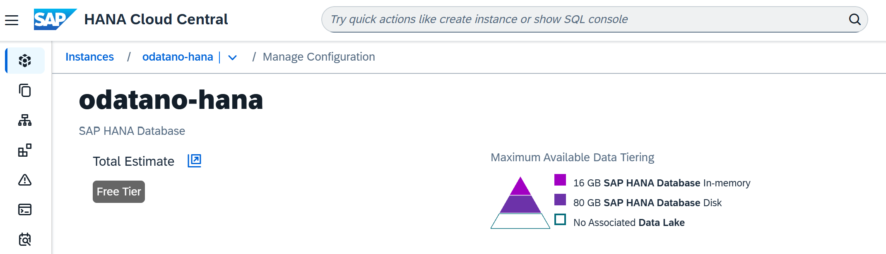

After deploying ODATANO to BTP, the OData service and the wallet viewer app appear in the application dev space

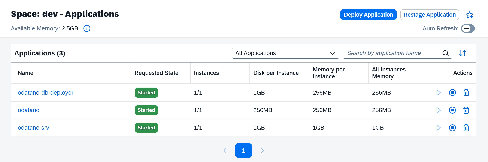

### OData Destination Binding

To connect your SAP applications to the ODATANO OData services, create a destination in BTP and bind it to your service instance.

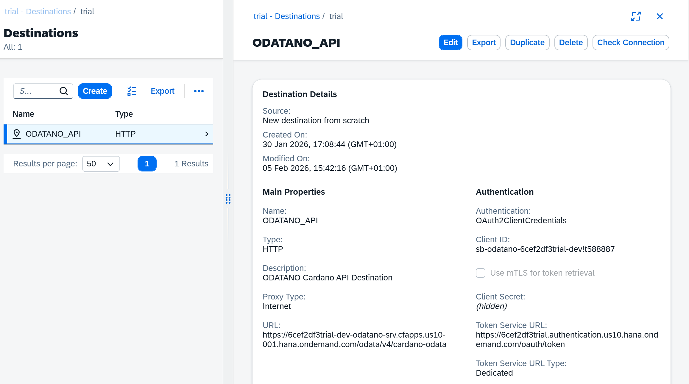

## Use API in SAP BUILD Process Automation

Add ODATANO_API Destination in your Process Automation project to call OData actions from your workflows. 

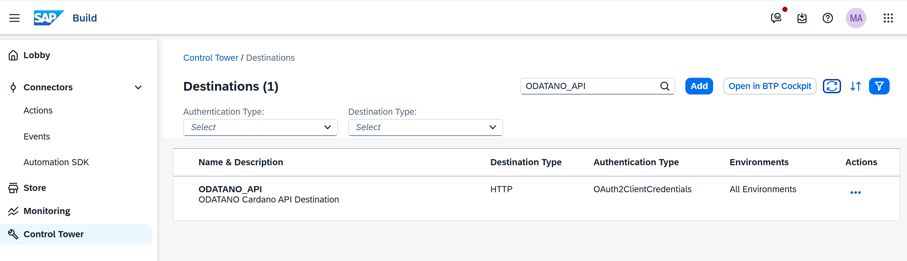

Now you can add ODATANO as Action in your workflow

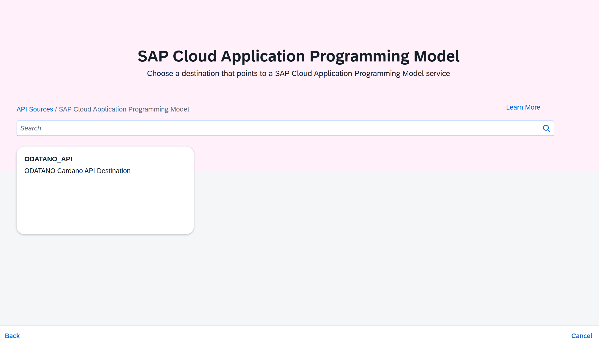

Explore the whole API and select the OData actions you want to use in your workflow, for example to get a specific block or transaction information from the Cardano blockchain. And use it in your workflow for example to get details of a payment transaction and use the information for further processing in your workflow.

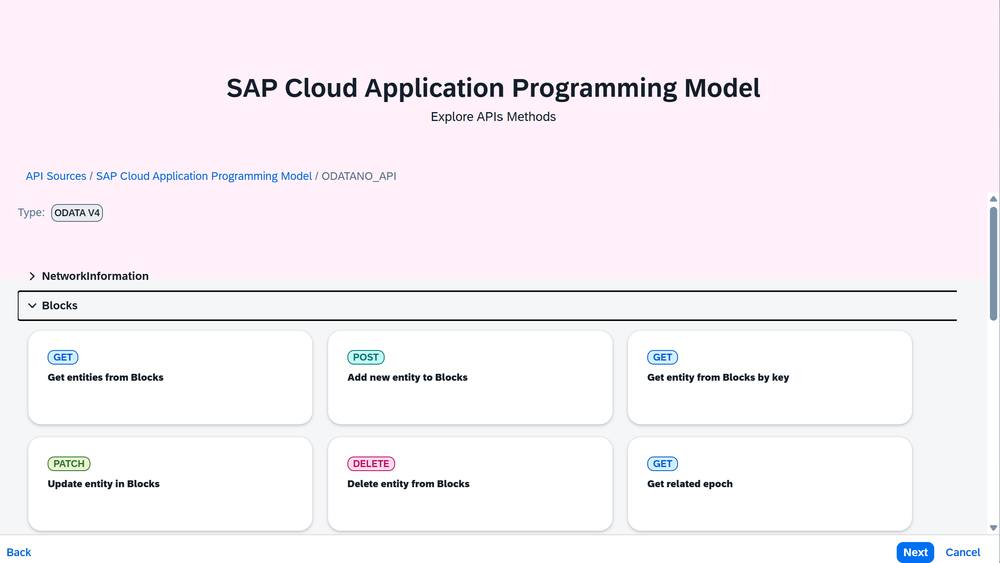

## Reacting to on-chain events instead of polling

The scenario below polls for a transaction's confirmation. Since v2.0 a CAP application embedding
`@odatano/core` can subscribe instead:

```js
const worker = await cds.connect.to('CardanoWorkerService');
worker.on('jobConfirmed', ({ data }) => { /* data.jobId, data.txHash — settle the business object */ });
worker.on('jobFailed',    ({ data }) => { /* data.errorCode, data.errorMessage */ });
```

This removes the polling loop entirely for anything submitted through the wallet worker. For
transactions submitted the synchronous way, `CardanoIndexerService`'s `blockIndexed` event carries
the tx hashes of each crawled block (crawler enabled).

## Example SAP Build Automation Scenario - ADA Invoice Check

A customer can send you a payment and submit the transaction hash to your workflow and you can use the transaction information to trigger further processing in your workflow.

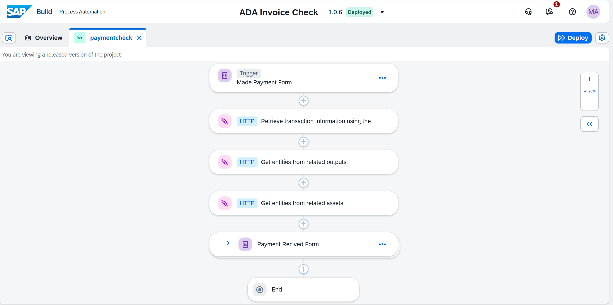

The first Step and trigger is a simple Form provided over a public link to the customer to submit the details of the made payment transaction

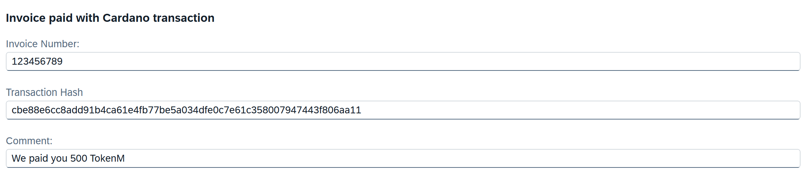

Now the workflow defined like above will fetch the transaction details from the Cardano blockchain with outputs and related assets and using the infomation to trigger a notification into your SAP Inbox with the details of the payment transaction and the attached assets to check the payment and confirm the payment details. 

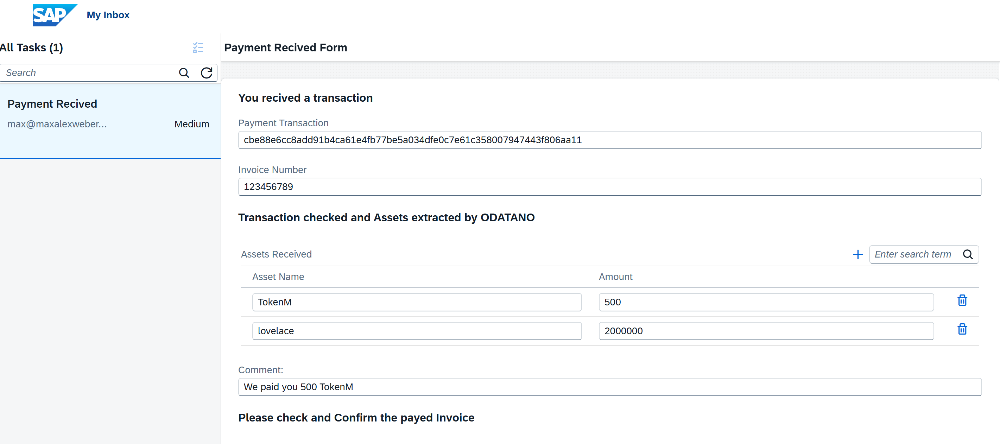

### Wallet Viewer Fiori App

The sample Wallet Viewer application running on BTP

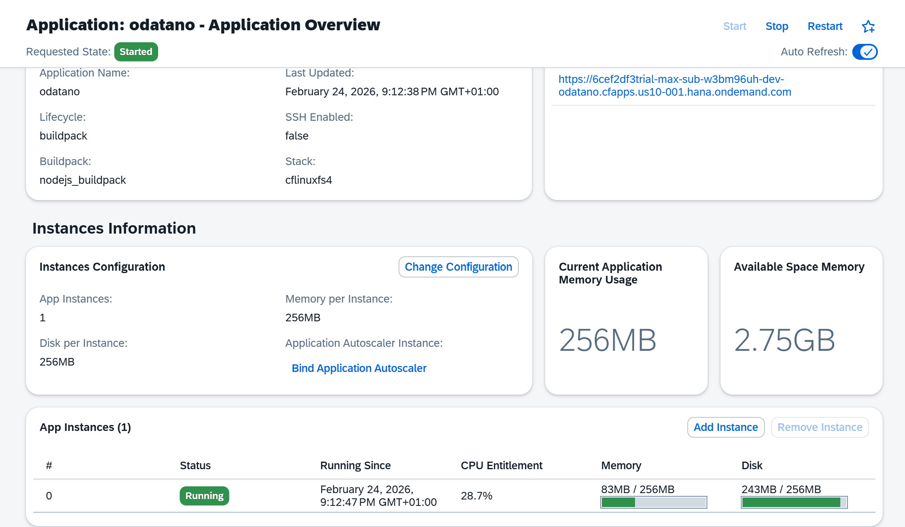

Start by connecting the App to one of your installed CIP-30 compatible wallets (e.g. Eternl, Lace, Vespr) or by pasting a Cardano address to view the related transactions and details. The Example app also allows you to build transactions with the connected wallet and submit them to the Cardano blockchain via ODATANO.

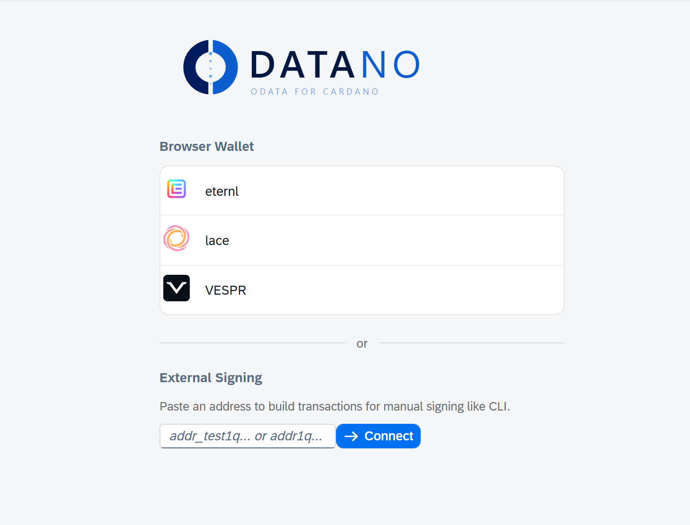

# Transaction flow with CIP-30 Wallet Signing inside the Wallet Viewer App

Build Transaction: User selects a transaction template and clicks "Build Transaction". The app calls the ODATANO OData service to build the transaction based on the selected template and user input.

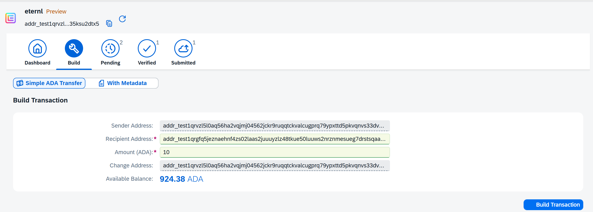

Review Build Result: The app displays the result of the transaction build, including the generated transaction details and any errors if the build failed.

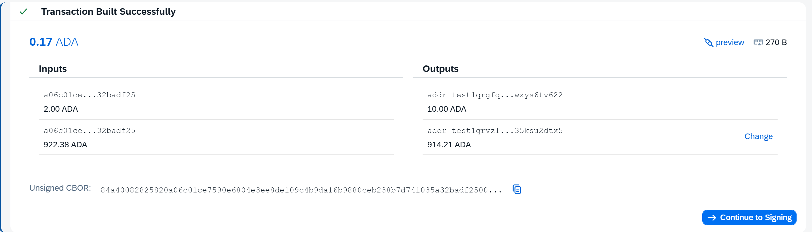

Review Transaction Details on Transaction Inspector

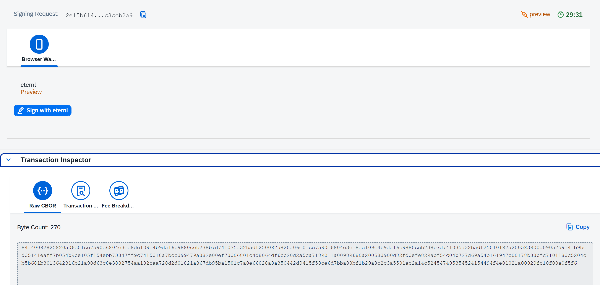


Signing with CIP-30 Wallet: The user approves the transaction in their wallet, which generates a signed transaction blob.

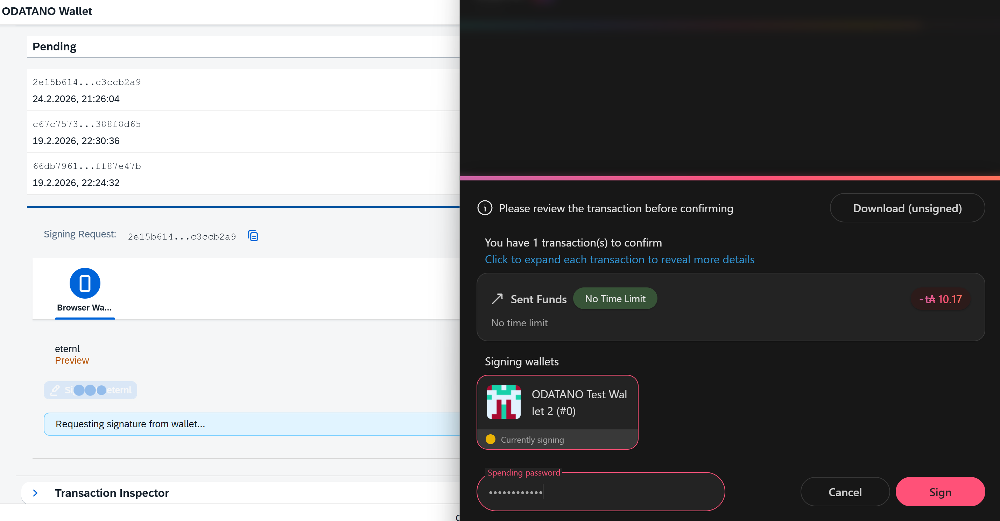

After Signing: the app sends the signed transaction blob back to ODATANO for verification & witness combination using the `SubmitVerifiedTransaction` OData action. ODATANO verifies the signature and transaction details before allowing it to be submitted to the blockchain.

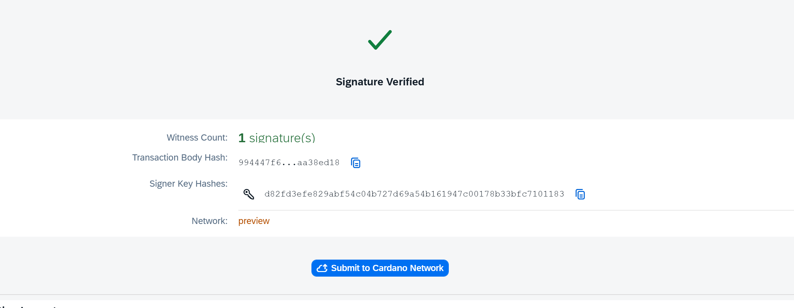

Submit Transaction: If verification is successful, ODATANO submits the transaction to the Cardano blockchain and returns the transaction hash to the app, which displays it to the user.

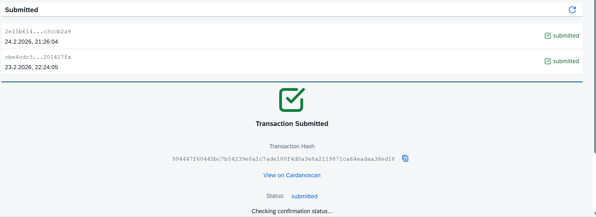

Link to Transaction on Cardano Explorer for the from SAP BTP deployed ODATANO instance:
https://preview.cardanoscan.io/transaction/994447f60445bc7b54239e8a1c7ade180f4d0a3e8a2119871ca64eadaa38ed18

## ABAP Integration Patterns & Reusable Code Templates

See [ABAP Code Examples](../abap%20examples/README.md) for detailed code snippets and templates to call ODATANO OData services from ABAP programs

## Enhanced Enterprise Use Cases

### TRACE — Pharmaceutical Supply Chain Tracking

TRACE is a full-stack SAP Fiori application that demonstrates how ODATANO enables enterprise-grade blockchain integration for pharmaceutical supply chain tracking. Built on top on ODATANO, TRACE provides tamper-proof chain-of-custody for drug batches from manufacturer to pharmacy. Each batch is represented as a Plutus V3 NFT with on-chain datum, and every handoff (manufacturer → distributor → pharmacy) is recorded as a Plutus spend transaction — all orchestrated through ODATANO's OData V4 actions.

Key capabilities demonstrated by TRACE:

- **Batch NFT Minting** with inline datum (ChainOfCustody) via `BuildMintTransaction`
- **Plutus Spend Transactions** for custody transfers via `BuildPlutusSpendTransaction`
- **Document Anchoring** of certificates and lab reports via CIP-20 metadata
- **CIP-30 Browser Wallet Signing** with the `SubmitVerifiedTransaction` flow
- **Parameterized Validators** using `scriptParamsJson` and `lockOnScript`

TRACE serves as a reference implementation for any enterprise looking to integrate Cardano smart contracts into SAP landscapes.

GitHub: [https://github.com/ODATANO/TRACE](https://github.com/ODATANO/TRACE)


